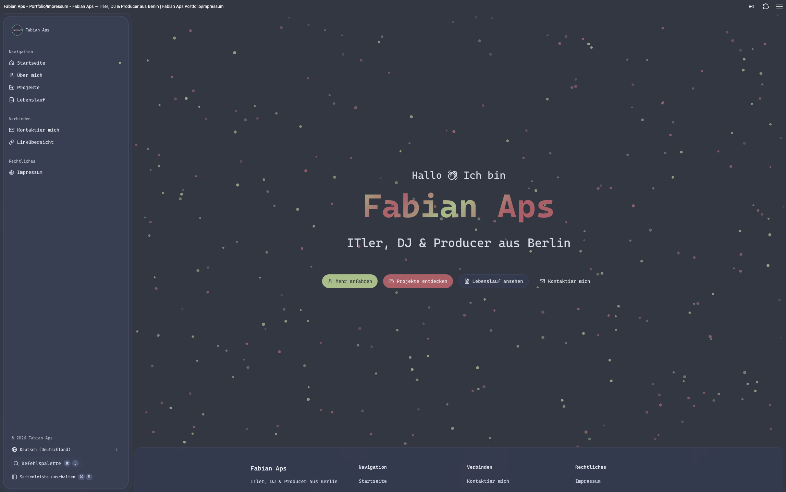

# Personal Portfolio Website

A customizable, open-source portfolio website template built with SvelteKit. Fork it, customize it, and make it your own!



> TODO: Add a screenshot of your portfolio.

[**Live Demo**](https://mcpeapsunterstrichhd.dev/)

> TODO: Add a link to your live demo.

## Features

- **SvelteKit:** A fast and modern web framework for building performant applications.
- **Tailwind CSS:** A utility-first CSS framework for rapid UI development.
- **shadcn-svelte:** A collection of accessible and customizable UI components.
- **Internationalization (i18n):** Easily translate your portfolio into multiple languages with `intlayer`.
- **PWA Ready:** Can be configured to be a Progressive Web App, allowing for offline access.
- **SEO Friendly:** SvelteKit provides a great foundation for building SEO-friendly websites.

## Getting Started

Follow these steps to get your portfolio up and running.

### Prerequisites

- [Node.js](https://nodejs.org/en/) (v18 or higher)
- [pnpm](https://pnpm.io/), [yarn](https://yarnpkg.com/), or [npm](https://www.npmjs.com/)

### Installation

1. **Fork this repository** to your own GitHub account.
2. **Clone your forked repository** to your local machine:
   ```bash
   git clone https://github.com/<your-username>/mcpeapsUnterstrichHD-website.git
   cd mcpeapsUnterstrichHD-website
   ```
3. **Install the dependencies:**
   - Using pnpm (recommended):
     ```bash
     pnpm install
     ```
   - Using yarn:
     ```bash
     yarn install
     ```
   - Using npm:
     ```bash
     npm install
     ```

### Running in Development Mode

Start the development server and open your browser to `http://localhost:3000`:

```bash
pnpm run dev
# or
yarn dev
# or
npm run dev
```

## Customization

All the content of the portfolio is stored in `.ts` files, making it easy to customize.

### Edit the Content

All text content, such as your name, bio, projects, and contact information, is located in the `src/lib/content/` directory. Each file corresponds to a different section of the website.

For example, to change the "About Me" section, edit the `src/lib/content/Aboutme.content.ts` file. To add or update your projects, modify `src/lib/content/Projects.content.ts`.

Here are some of the key files you might want to edit:

- `src/lib/content/Aboutme.content.ts`
- `src/lib/content/Contact.content.ts`
- `src/lib/content/CV.content.ts`
- `src/lib/content/Project.content.ts`

### Styling and Theme

The overall styling can be customized in the `src/app.css` file. This is where you can change colors, fonts, and other visual aspects of the site. The project uses Tailwind CSS, so you can also use utility classes directly in your Svelte components.

For more advanced customizations of the UI components, refer to the "Maintenance" section below.

## Building for Production

To create a production build of your site:

```bash
pnpm run build
# or
yarn build
# or
npm run build
```

You can preview the production build with `pnpm run preview`.

## License

This project is licensed under the MIT License. See the [LICENSE](LICENSE) file for details. You are free to use, modify, and distribute this template for your own personal use.

<details>
<summary><b>Maintenance and Developer Notes</b></summary>

# sv

Everything you need to build a Svelte project, powered by [`sv`](https://github.com/sveltejs/cli).

## Creating a project

If you're seeing this, you've probably already done this step. Congrats!

```sh
# create a new project
npx sv create my-app
```

To recreate this project with the same configuration:

```sh
# recreate this project
bun x sv create --template demo --types ts --add devtools-json sveltekit-adapter="adapter:auto" tailwindcss="plugins:typography,forms" paraglide="languageTags:de-de, en-us+demo:yes" --install bun mcpeapsUnterstrichHD-sveltekit
```

## Developing

Once you've created a project and installed dependencies with `npm install` (or `pnpm install` or `yarn`), start a development server:

```sh
npm run dev

# or start the server and open the app in a new browser tab
npm run dev -- --open
```

## Building

To create a production version of your app:

```sh
npm run build
```

You can preview the production build with `npm run preview`.

> To deploy your app, you may need to install an [adapter](https://svelte.dev/docs/kit/adapters) for your target environment.

---

## Updating shadcn-svelte Components

All shadcn-svelte component files can be safely overwritten because the Liquid Glass
visual customisations live in `src/app.css` via `[data-slot="..."]` CSS selectors,
not inside the component files themselves.

### 1. Reset all components to latest defaults

```sh
npx shadcn-svelte@latest add --all --yes --overwrite
```

If pnpm fails with a store mismatch, run:

```sh
CI=true pnpm install
```

### 2. Re-apply functional changes

The following files contain **functional** (not visual) modifications that the
overwrite will reset. Re-apply them after every update:

#### `src/lib/components/ui/sidebar/context.svelte.ts`

Add the `IsTablet` import and wire it into `SidebarState`:

```diff
 import { IsMobile } from "$lib/hooks/is-mobile.svelte.js";
+import { IsTablet } from "$lib/hooks/is-tablet.svelte.js";
```

```diff
 class SidebarState {
   #isMobile: IsMobile;
+  #isTablet: IsTablet;

   constructor(props: SidebarStateProps) {
     this.#isMobile = new IsMobile();
+    this.#isTablet = new IsTablet();
   }

+  get isTablet() {
+    return this.#isTablet.current;
+  }
 }
```

#### `src/lib/components/ui/sidebar/sidebar-provider.svelte`

Add the `untrack` import and the tablet auto-collapse effect:

```diff
+import { untrack } from "svelte";
```

After the `setSidebar(...)` call, add:

```svelte
$effect(() => {
  if (sidebar.isTablet) {
    untrack(() => sidebar.setOpen(false));
  }
});
```

### 3. Files you do NOT need to touch

These are handled entirely by CSS in `src/app.css` (data-slot overrides):

- `dialog/dialog-content.svelte` — glass thick
- `alert-dialog/alert-dialog-content.svelte` — glass thick
- `sheet/sheet-content.svelte` — glass thick
- `drawer/drawer-content.svelte` — glass thick
- `popover/popover-content.svelte` — glass standard
- `hover-card/hover-card-content.svelte` — glass standard
- `tooltip/tooltip-content.svelte` — glass thin
- `tabs/tabs-list.svelte` — glass thin
- `input/input.svelte` — subtle blur

### 4. Files that are never overwritten

These are custom files outside the shadcn-svelte component tree:

- `src/lib/hooks/is-tablet.svelte.ts` — `IsTablet` media query class
- `src/lib/components/TabBar.svelte` — iOS-style bottom tab bar
- `src/lib/components/AppSidebar.svelte` — macOS-style sidebar
- `src/app.css` — all glass material utilities and data-slot overrides

</details>

# Getting the WASM file

the wasm file is from the Repo [comboomPunkTsucht/comboom_punkt_sucht_native_wallpaper](https://github.com/comboomPunkTsucht/comboom_punkt_sucht_native_wallpaper.git):  [eabf73a](https://github.com/comboomPunkTsucht/comboom_punkt_sucht_native_wallpaper/commit/eabf73ad91b8b4a479654c1df7e361ef5c9b7024)

# UI Components Origons

[shadcn-svelte](https://shadcn-svelte.com/ "shadcn-svelte")

[shadcn-svelte-extras](https://www.shadcn-svelte-extras.com/ "shadcn-svelte-extras")
